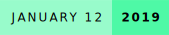
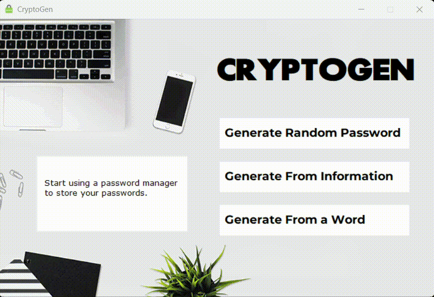
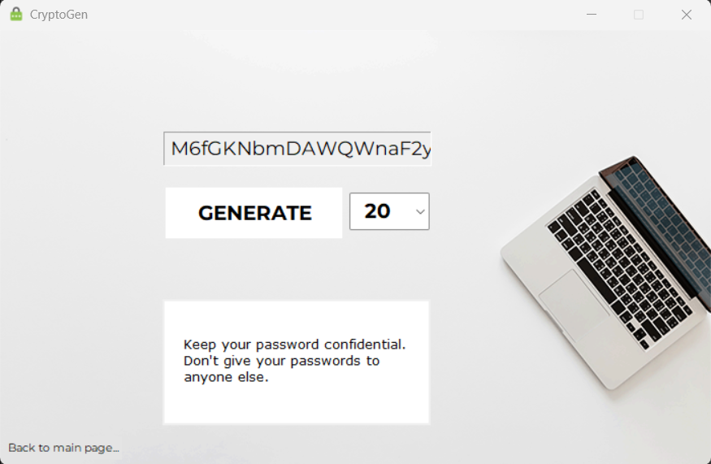
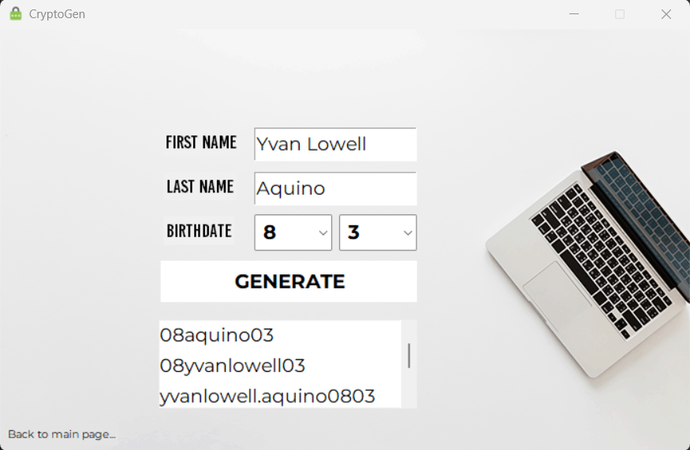
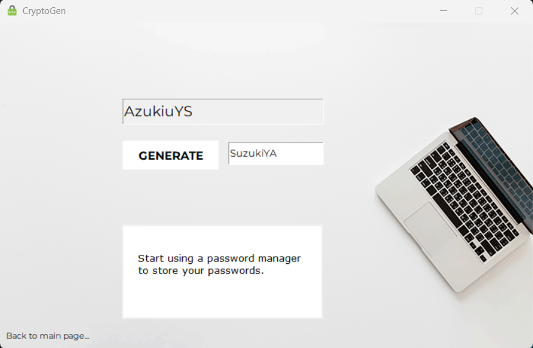

# Cryptogen
  

  

Crytogen is a simple application that can generate passwords. It is Python-based and it can generate a random password, a password from your information, and one from a word.

### Author's Notes
I consider this as the final entry of my **3 Mini Python GUI Projects**. The other ones are [shuffle](https://github.com/Lowell0803/shuffle-randomizer) and [rock, paper, and scissors](https://github.com/Lowell0803/rock-paper-scissors). These projects were made purely out of passion and my desire to enhance my Python skills. Nowadays, this project can be done in less than a day with the help of LLMs. 

Looking back at it, only the *generate random password* feature of the application is practical. But, cut me some slack, I was 15 years old lol.

## Screenshots

	<h3>Generate Random Password</h3>
	
	<h3>Generate From Info</h3>
	
	<h3>Generate From a Word</h3>
	

## How to Run

You can download the source code and **install all the fonts in the `fonts/` folder**. Then, run using `py .\cryptogen.py`.

## Feedback

If you have any feedback/comment/request, please reach out to [aquino.ylt@gmail.com](mailto:aquino.ylt@gmail.com).

### Thank you and God bless!
